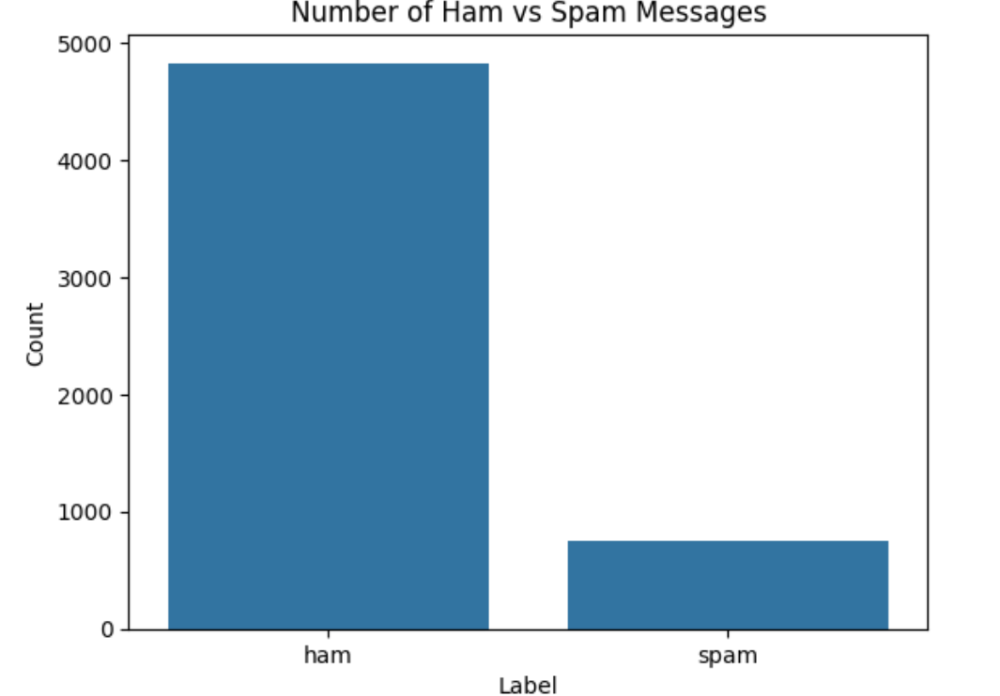
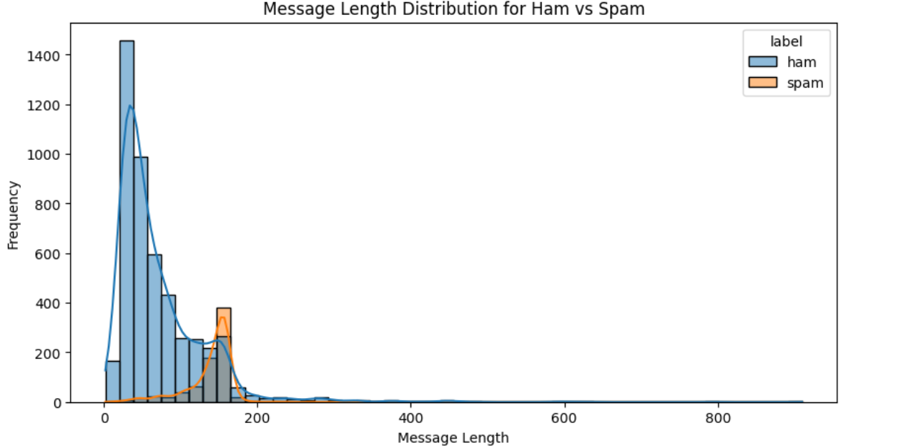

# 📩 SMS Spam Predictor

A machine learning-based web application that classifies SMS messages as **Spam** or **Ham (Not Spam)** using NLP and classification algorithms.

The dataset is a highly imbalanced one with the percentage of HAM(non-spam)messages being 85%.



---

## 🚀 Features

- ✅ Predicts whether a given message is spam or not
- ✅ Clean and intuitive UI
- ✅ Trained on the popular [SMS Spam Collection Dataset](https://www.kaggle.com/datasets/uciml/sms-spam-collection-dataset)
- ✅ Visualization of word frequencies and message length distributions

---

## 🧠 Model Used

- **Algorithm**: Naive Bayes / Support Vector Machine (choose whichever you used)
- **Libraries**: `scikit-learn`, `pandas`, `numpy`, `matplotlib`, `seaborn`
- **Vectorization**: `CountVectorizer` / `TF-IDF`

---

## 📊 Exploratory Data Analysis



- Spam messages tend to be longer and include promotional words.
- Word clouds and bar plots were used to identify top keywords in spam vs ham.

---

## 🧪 How to Run Locally

1. **Clone the repo**
   ```bash
   git clone https://github.com/deBurglar/SMS-Spam-Predictor.git
   cd SMS-Spam-Predictor
